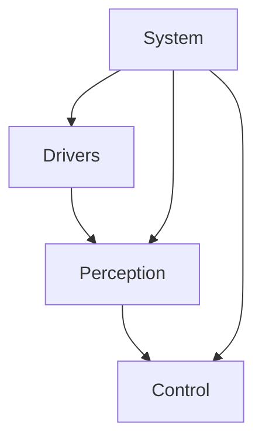

# System Architecture

## Overview
This document describes the overall architecture of the drone mapping system.

## Component Diagram

```
┌─────────────────────────────────────────────────────────────┐
│                     Drone Mapping System                     │
├─────────────────────────────────────────────────────────────┤
│                                                               │
│  ┌──────────────┐  ┌──────────────┐  ┌──────────────┐      │
│  │   Drivers    │  │  Perception  │  │   Control    │      │
│  ├──────────────┤  ├──────────────┤  ├──────────────┤      │
│  │ LiDAR        │  │ Point-LIO    │  │ Mission Ctl  │      │
│  │ IMU          │──▶│ SLAM         │──▶│ Health Mon   │      │
│  │ Camera       │  │ Hailo AI     │  │ Failsafe     │      │
│  │ MAVLink      │  │ Fusion       │  │              │      │
│  └──────────────┘  └──────────────┘  └──────────────┘      │
│                                                               │
│  ┌──────────────────────────────────────────────────────┐   │
│  │                    System Layer                       │   │
│  ├──────────────────────────────────────────────────────┤   │
│  │  Launch Files │ TF Tree │ Parameters │ Logging       │   │
│  └──────────────────────────────────────────────────────┘   │
│                                                               │
└─────────────────────────────────────────────────────────────┘
```

## Data Flow

### Sensor Pipeline
1. LiDAR driver publishes raw point clouds
2. IMU driver publishes orientation data
3. Point-LIO processes and registers point clouds
4. Camera captures RGB images
5. Hailo AI performs object detection
6. Semantic fusion combines LiDAR + AI detections

### Control Loop
1. Mission control receives waypoints
2. Health monitor checks system status
3. Failsafe manager handles emergencies
4. MAVLink bridge sends commands to drone

## Package Dependencies



## TODO
- [ ] Add detailed component descriptions
- [ ] Document inter-node communication
- [ ] Add timing diagrams
- [ ] Document data structures